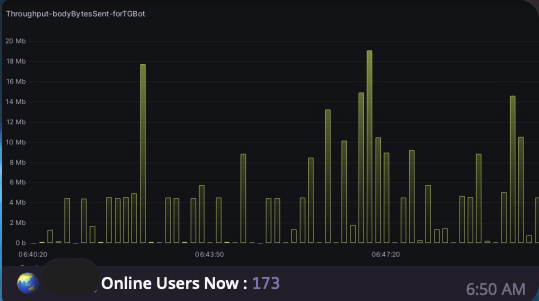

# Throughput-User_Count_Bot

## Design concept
* Monitor Real-Time Traffic and Real-Time Visitors


## Tools and Techniques Required
* User Count Exporter (Scrape Data Using Crawlers)
* Grafana (Visualize Network Traffic)

## Periodically Send Data & command Execution Concurrently 
* To make Periodically Send Data and command Execution Concurrently Available, you should using multiprocessing

## Commands

### throughput
```=Bash
/throughput
```
* Capture the screenshot from Grafana and crop it , then sending the image to TG


### count
```=Bash
/count
```
* Sending text(datas that formatted by Get_website_UserCount()) to TG


## Result



